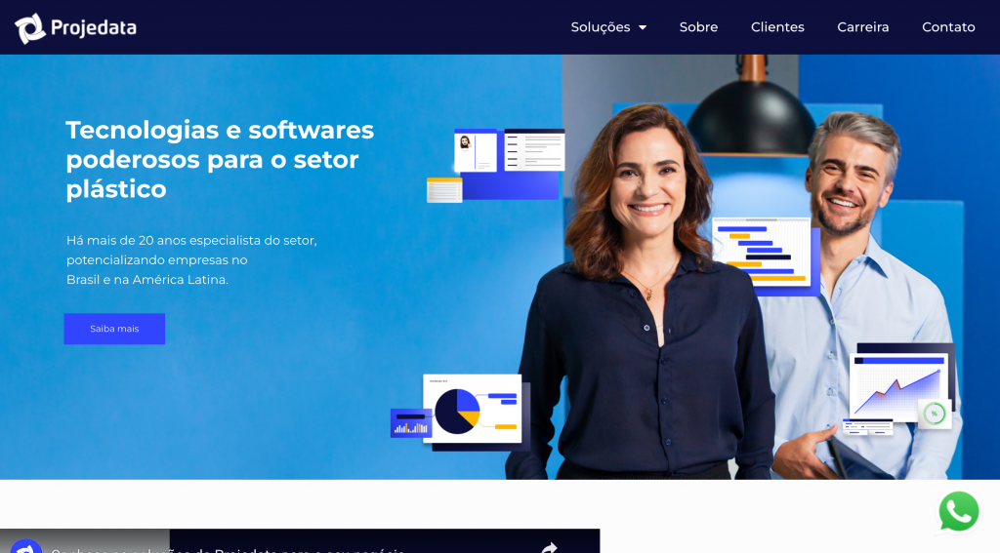
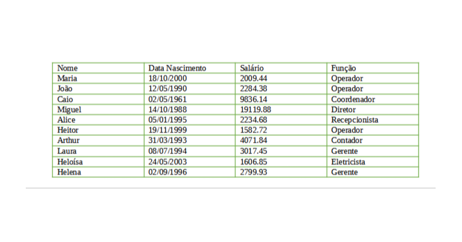
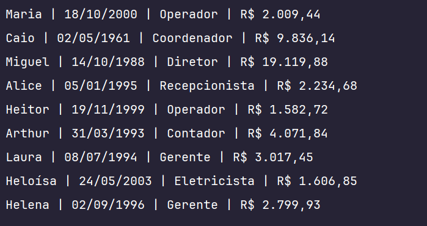
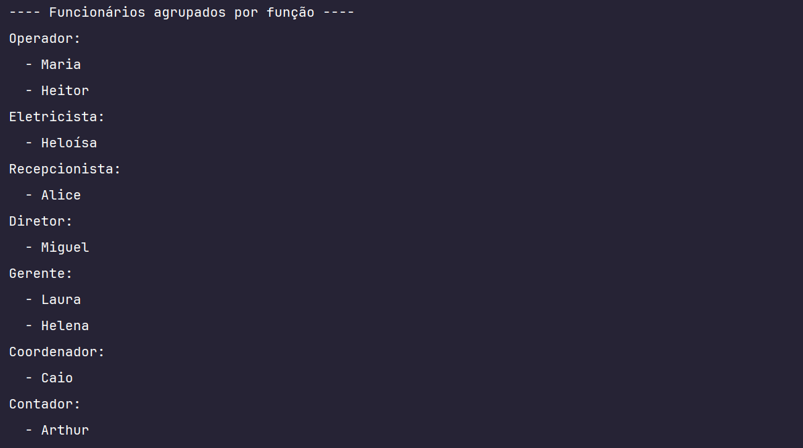
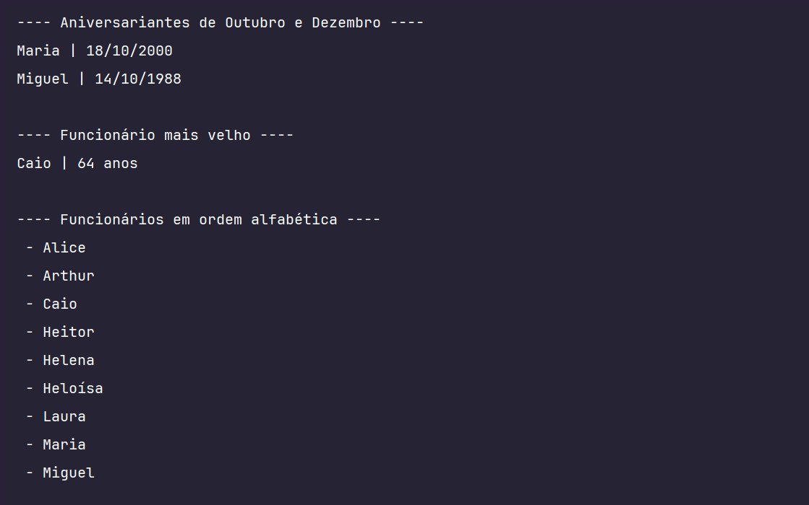

## TESTE INIFLEX - PROJEDATA
##### Candidato: André Deomondes

### TESTE PRÁTICO PROGRAMAÇÃO.
Considerando que uma indústria possui as pessoas/funcionários abaixo:

Diante disso, você deve desenvolver um projeto java, com os seguintes requisitos:

1– Classe Pessoa com os atributos: nome (String) e data nascimento (LocalDate).
  
2 – Classe Funcionário que estenda a classe Pessoa, com os atributos: salário (BigDecimal) e função (String).
 

3 – Deve conter uma classe Principal para executar as seguintes ações:
  
3.1 – Inserir todos os funcionários, na mesma ordem e informações da tabela acima.
  
3.2 – Remover o funcionário “João” da lista.
  
3.3 – Imprimir todos os funcionários com todas suas informações, sendo que:
  
• informação de data deve ser exibido no formato dd/mm/aaaa;
  
• informação de valor numérico deve ser exibida no formatado com separador de milhar como ponto e decimal como vírgula.
  
3.4 – Os funcionários receberam 10% de aumento de salário, atualizar a lista de funcionários com novo valor.
  
3.5 – Agrupar os funcionários por função em um MAP, sendo a chave a “função” e o valor a “lista de funcionários”.
  
3.6 – Imprimir os funcionários, agrupados por função.
  
3.8 – Imprimir os funcionários que fazem aniversário no mês 10 e 12.
  
3.9 – Imprimir o funcionário com a maior idade, exibir os atributos: nome e idade.
  
3.10 – Imprimir a lista de funcionários por ordem alfabética.
  
3.11 – Imprimir o total dos salários dos funcionários.
  
3.12 – Imprimir quantos salários mínimos ganha cada funcionário, considerando que o salário mínimo é R$1212.00.
  

Orientações gerais:
 
 
• você poderá utilizar a ferramenta que tem maior domínio (exemplos: eclipse, netbeans etc);
  
• após finalizado o desenvolvimento, exportar o projeto e encaminhar o link do seu teste aqui mesmo na etapa Mão na Massa 🖐.
  
Basta Colar o link ainda aqui nessa etapa.
  
• Assim que recebermos seu projeto desenvolvido, será agendada uma entrevista com nosso time técnico para avaliação.
  
Esperamos que você use todo seu conhecimento e criatividade nesse teste.
  

Caso você não souber resolver determinado requisito comente no código que aquele item você não sabe como desenvolver, e vá para o próximo.
  
Avaliaremos o que você conseguiu desenvolver e como foi desenvolvido.
  

  

## Resultados no Terminal

  

